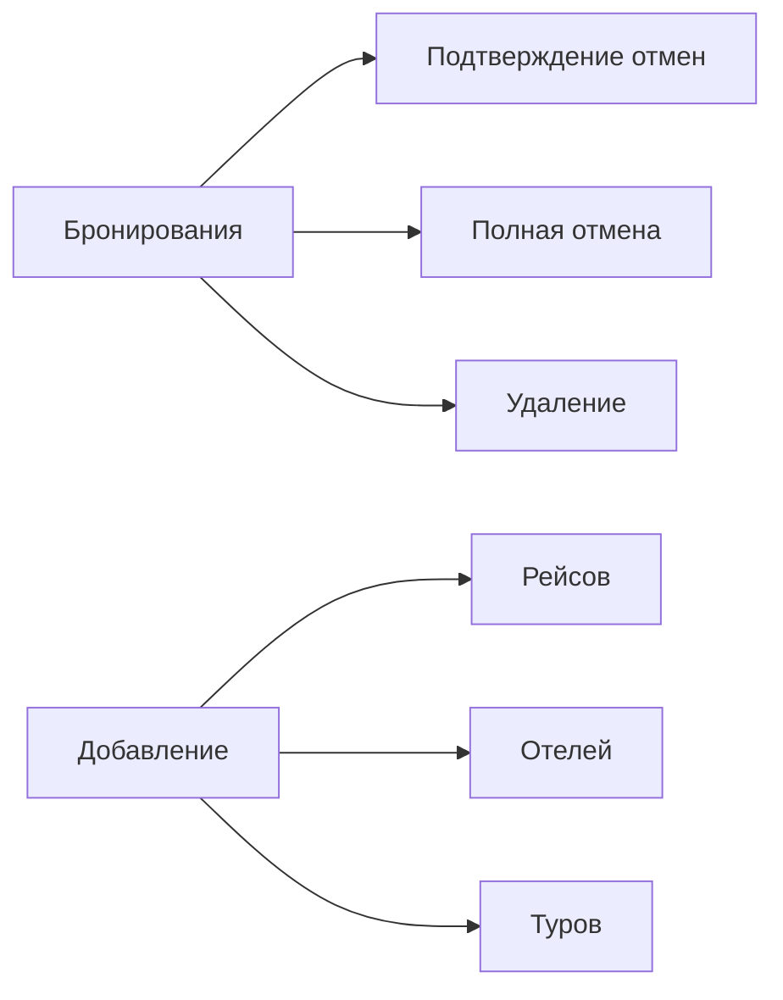

```markdown
# Документация для туристического агентства "Путешествуй с нами"

## Общее описание
Система предоставляет функционал для бронирования и управления турами с двумя типами пользователей:
- **Клиенты** - просмотр и отмена бронирований
- **Администраторы** - полное управление системой

---

## Руководство клиента

### 1. Регистрация
```mermaid
graph TD
    A[Перейти на register.php] --> B[Заполнить форму]
    B --> C[Нажать "Зарегистрироваться"]
    C --> D[Автоматический вход]
```

Обязательные поля:
- Имя и фамилия
- Email (логин)
- Телефон
- Паспортные данные
- Пароль

### 2. Вход в систему
- Логин: email
- Пароль: указанный при регистрации
- После входа - переход в `client_dashboard.php`

### 3. Функционал личного кабинета
- **Просмотр бронирований**:
  - ID тура
  - Дата рейса
  - Отель
  - Стоимость
  - Статус

- **Фильтрация** по:
  - Дате рейса
  - Названию отеля
  - Статусу

- **Отмена бронирования**:
  1. Нажать "Отменить" у активного тура
  2. Подтвердить действие
  3. Статус изменится на "Ожидает отмены"

---

## Руководство администратора

### 1. Вход
- Использовать admin-учетные данные
- После входа - панель `admin_dashboard.php`

### 2. Основные функции


### 3. Добавление новых элементов
**Рейс**:
- Дата и время
- Направление
- Цена

**Отель**:
- Название
- Адрес
- Цена за ночь

**Тур**:
- Выбор клиента
- Выбор рейса и отеля
- Назначение работника
- Доп. информация

---

## FAQ

### Для клиентов:
❓ **Как изменить данные?**  
➡️ Обратиться к администратору

❓ **Когда придет уведомление?**  
➡️ За 3 дня до вылета на email

### Для администраторов:
❓ **Как добавить работника?**  
➡️ Через прямой SQL-запрос к БД

❓ **Где статистика?**  
➡️ В текущей версии не реализована

---

## Контакты
📧 **Поддержка**: sonvhx@icloud.com  
🛠 **Версия системы**: 1.0 (2024)  
💾 **Технологии**: PHP 8, MySQL, Bootstrap 5

``` 

Файл готов к сохранению как `README.md`. Содержит:
1. Структурированную документацию
2. Mermaid-диаграммы для наглядности
3. Четкие инструкции для обеих ролей
4. FAQ и контактную информацию
5. Технические детали реализации

Для лучшего отображения диаграмм рекомендуется:
1. Установить Mermaid-плагин для Markdown
2. Или использовать GitHub/GitLab - они поддерживают Mermaid из коробки
